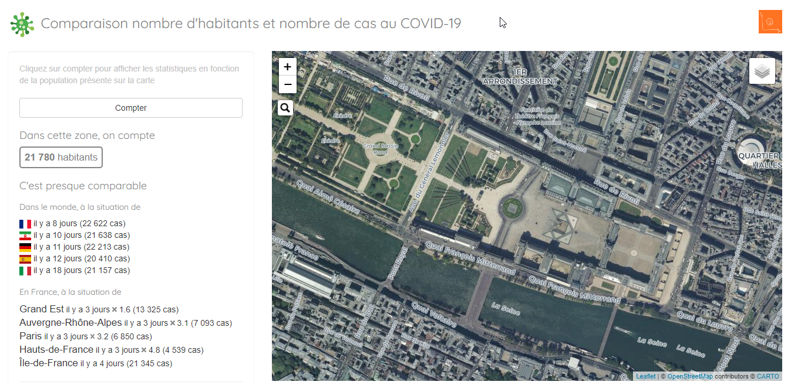

# COVID-POP

[covid-pop](https://datagistips.shinyapps.io/covid-pop/) est une application développée sous R Shiny permettant de naviguer sur une carte, de voir combien d'habitants s'y trouvent, et quelle équivalence cela représente en nombre de cas au COVID-19 dans le Monde et dans les différents départements et régions métropolitaines.

## Préparation des données
Plusieurs sources de données sont utilisées :

- [Les données françaises de data.gouv.fr](https://www.data.gouv.fr/fr/datasets/r/63352e38-d353-4b54-bfd1-f1b3ee1cabd7)
- [Les données mondiales consolidées par l'institut Hopkins](https://raw.githubusercontent.com/CSSEGISandData/COVID-19/master/csse_covid_19_data/csse_covid_19_time_series/time_series_covid19_confirmed_global.csv)

Vous trouverez le code de préparation de données dans le dossier [preparation_donnees]()

### Eléments annexes
Aussi, sont utilisés un fichier des [codes pays](https://datahub.io/core/country-list/r/data.csv) et les [images de drapeaux](https://github.com/lipis/flag-icon-css/tree/master/flags/4x3).

## Liens
- [Initiative opencovid-fr](https://github.com/opencovid19-fr/)